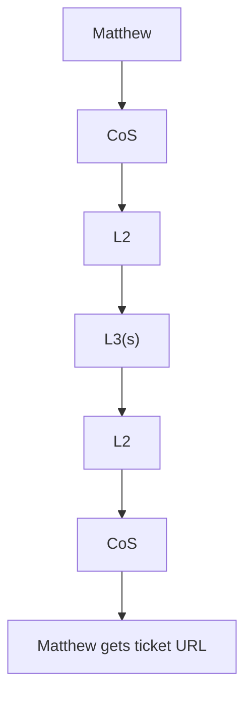
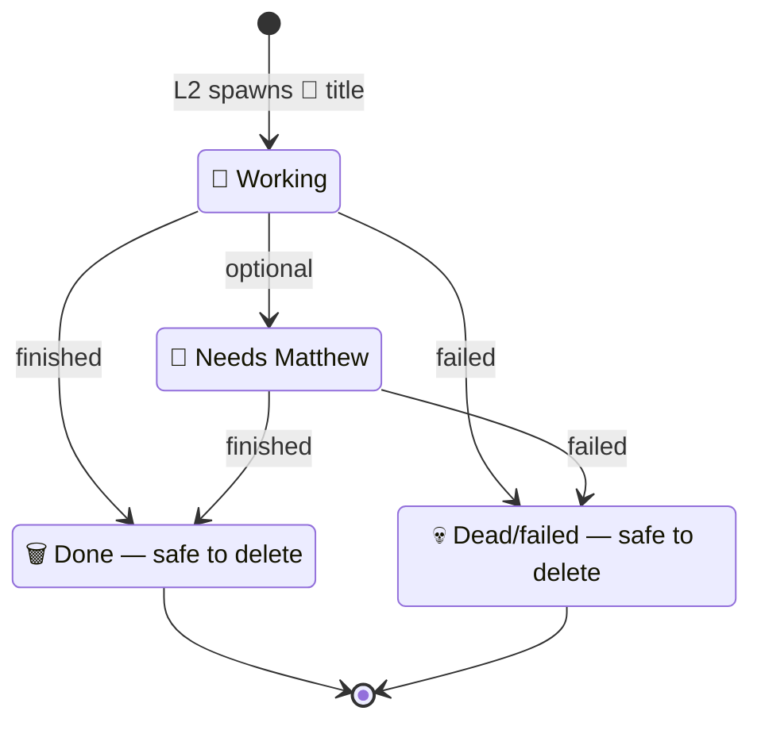
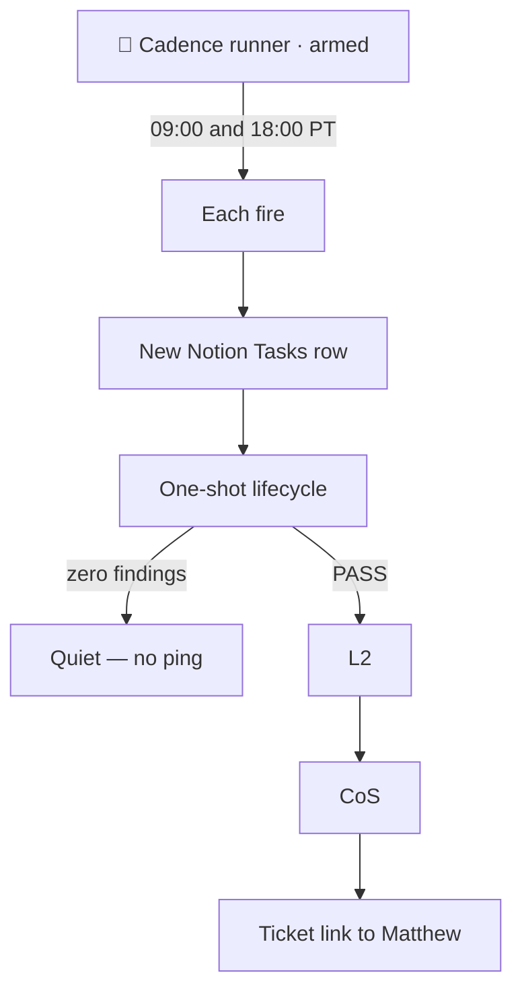
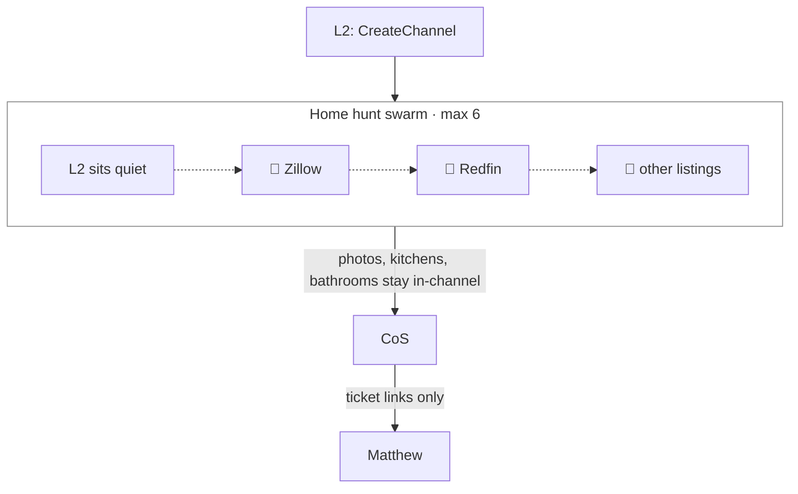

# BotOps

The BotOps lifecycle skill for Matthew’s Grok Bot fleet, shaped to the [Agent Skills](https://agentskills.io/specification) standard.

It is the single lifecycle for that fleet: Chief of Staff (L1) → domain owners (L2) → one-shot temps and cadence runners (L3), with Notion as the source of record. Load this skill for non-trivial fleet work rather than splitting the lifecycle across other skills.

Operating model at a glance below. Fuller diagrams and facts live in [`botops/references/`](botops/references/). Narrative: **[How I Run Grok Bot with BotOps](https://granda.org/en/2026/09/06/how-i-run-grok-bot/)**.

## Operating model

Four constraints:

1. **One interface.** Talk to Chief of Staff. Everyone else stays off DMs unless Matthew chooses otherwise.
2. **Notion is the source of record.** Projects and Tasks hold the work. Chat hands a ticket URL, not a novel.
3. **Workers are disposable and labeled.** Temps spawn with an emoji readable from the sidebar. When they are done or dead, delete them.
4. **Quiet is the default.** No findings, no ping. Swarm noise stays in the swarm.

**Status** moves in one direction unless something actually changed:

Backlog → Ready → In progress → Waiting / Blocked → In review → Done / Cancelled

- **Waiting** = someone outside this stack.
- **Blocked** = Matthew — and Blocked requires a Block reason.
- Visual work that lands in **In review** needs scrollable pictures attached to the ticket.

**Hard rules**

- Only L3 launches Cursor cloud agents and owns recurring routines.
- Multi-L3 jobs always swarm, with claim and dedupe. Max six in a channel.
- No new durable L2 until Matthew says yes.
- CoS chat stays decision-dense: intake, assignment, ticket link — no browse logs or play-by-play.

See [four layers](botops/references/layers.md) and [hard rules + quiet default](botops/references/rules.md).

## Happy path (one-shot)

Matthew → CoS → L2 → L3(s) → L2 → CoS → Matthew gets the ticket URL.



More: [botops/references/happy-path.md](botops/references/happy-path.md).

## L3 emoji lifecycle

Durable L1 and L2 names stay plain. Only L3s get an emoji prefix. L2 renames the temp on every state change.

| Prefix | Meaning | Matthew action |
|---|---|---|
| 🔄 | Working | Leave it |
| 🔔 | Needs Matthew | Open the ticket, or reply to CoS |
| 🗑 | Done — safe to delete | Delete from sidebar |
| 💀 | Dead / failed — safe to delete | Delete from sidebar |



More: [botops/references/emoji-lifecycle.md](botops/references/emoji-lifecycle.md).

## Cadence runners

All recurring work is kicked off by an L3 cadence runner — not CoS, not L2. Each fire opens a new Tasks row, then runs the one-shot lifecycle. Zero findings stay quiet. A pass Matthew should see goes L2 → CoS → ticket link.



More: [botops/references/cadence.md](botops/references/cadence.md).

## Swarm channels

L2 opens the channel (`CreateChannel`). L2 sits quiet; L3s work in-channel (max 6). CoS is not in the room — it only surfaces ticket links. Keep the channel while the project is open or any cadence for it is still armed.



One-shot vs standing cadence swarms: [botops/references/swarms.md](botops/references/swarms.md).

## Skill layout

```
botops/
├── SKILL.md
└── references/
    ├── layers.md
    ├── happy-path.md
    ├── emoji-lifecycle.md
    ├── cadence.md
    ├── swarms.md
    └── rules.md
```

The skill directory is `botops/`. Its folder name must match frontmatter `name: botops`. `SKILL.md` is the lean Agent Skills lifecycle doc. Long Mermaid and key-fact pages live in [`botops/references/`](botops/references/) (the Agent Skills `references/` directory).

## Install / usage

Clone this repository and load the `botops/` skill directory in any Agent Skills–compatible client. Copy or symlink that folder into the client’s skills path (project-level `.agents/skills/botops`, or a user-level directory such as `~/.agents/skills/botops` or `~/.cursor/skills/botops`).

```bash
git clone https://github.com/granda/botops.git
cp -R botops ~/.agents/skills/botops
```

Compatible clients discover `SKILL.md` and activate the skill from its `name` and `description`.

## How I Run Grok Bot with BotOps

Narrative context for this skill lives in **[How I Run Grok Bot with BotOps](https://granda.org/en/2026/09/06/how-i-run-grok-bot/)**.

## Validate

```bash
npx skills-ref validate ./botops
```

## License

MIT. See [LICENSE](LICENSE).
