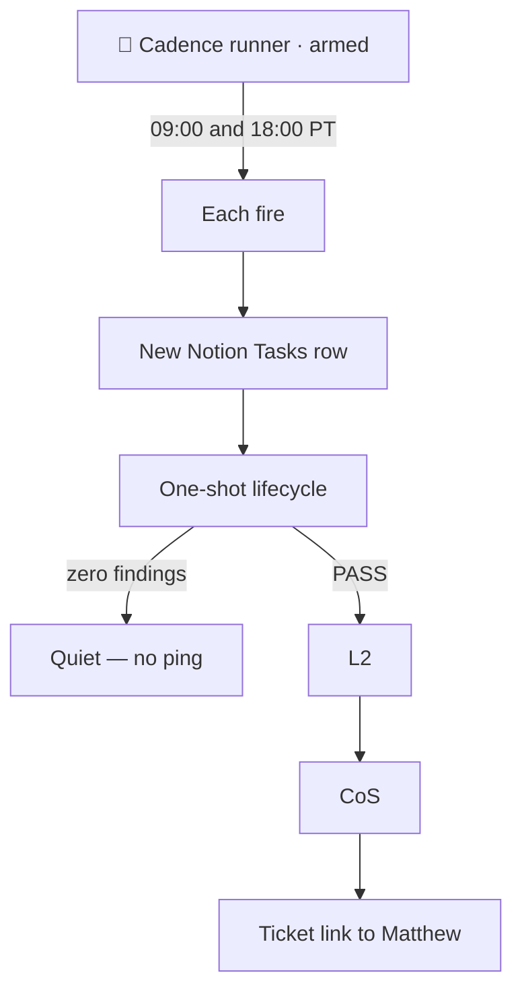

# Routines are L3 cadence runners

All recurring work is kicked off by an L3 cadence runner — not CoS, not L2. CoS should not be holding a cron in its head. L2 should not be using its own chat as a standing job.

Each fire opens a new Tasks row, then runs the one-shot lifecycle. Zero findings stay quiet. A pass that Matthew should see goes L2 → CoS → ticket link.

Home hunt is the cadence that actually runs: L3s named something like `🔄 Home hunt · Zillow cadence`, armed for 9:00 and 18:00 PT. Most fires find nothing worth a look. Those stay silent. When a listing is worth his time, he gets a ticket, not a dump of every card on the page.

The runner stays 🔄 while it is armed. The swarm channel for that project stays up for as long as the cadence is live.

See also: [happy path](happy-path.md) · [swarms](swarms.md) · [How I Run Grok Bot with BotOps](https://granda.org/en/2026/09/06/how-i-run-grok-bot/)
