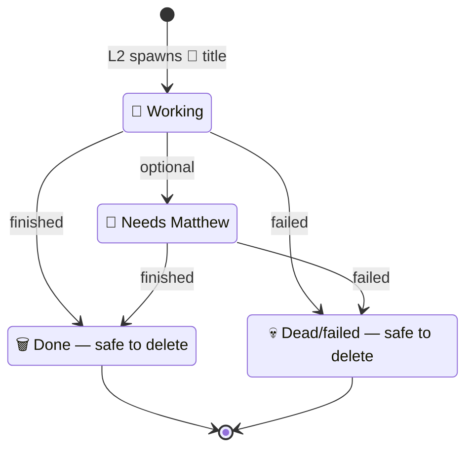

# L3 emoji lifecycle

Durable L1 and L2 names stay plain. Only L3s get an emoji prefix. Temps spawn as `🔄 `. Cadence runners stay 🔄 the whole time they are armed. L2 renames the temp on every state change — that is how the sidebar stays a triage list instead of a lie.

What Matthew does with a temp is entirely in the prefix:

| Prefix | Meaning | Matthew action |
|---|---|---|
| 🔄 | Working | Leave it |
| 🔔 | Needs Matthew | Open the ticket, or reply to CoS |
| 🗑 | Done — trash; safe to delete | Delete from sidebar |
| 💀 | Dead / failed — safe to delete | Delete from sidebar |

Throwaway L3 only. Durable L1/L2 names stay plain. L2 renames on every state change.

If a name has no emoji, it is durable and he leaves it alone. If it is 🔄, he does not poke it. If it is 🔔, that is his queue. 🗑 and 💀 get swept.

He deletes from the sidebar. L2 marks. That is the contract.

See also: [cadence](cadence.md) · [swarms](swarms.md) · [How I Run Grok Bot with BotOps](https://granda.org/en/2026/09/06/how-i-run-grok-bot/)
