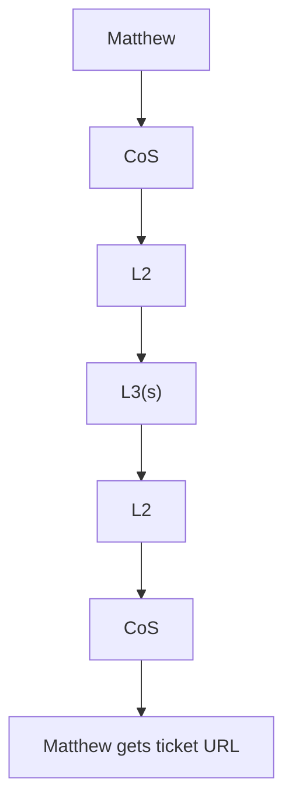

# Happy path (one-shot)

One-shot work is a straight line:

Matthew → CoS → L2 → L3(s) → handback L3 → L2 → CoS → Matthew gets the ticket link.

The example that actually runs is Home hunt. Matthew tells CoS to keep watching listings. CoS files a Task, assigns Household. Household opens a CreateChannel swarm and fires scouts in parallel — Zillow, Redfin, whatever other listing source is in play. Each L3 digs through listing photos and judges whether the kitchens and bathrooms match the musts. When a listing is worth a look, L3 hands back to Household, Household to CoS, CoS drops the ticket URL. Matthew opens Notion. He does not scroll a worker transcript unless he is curious.

They do not fork into uncoordinated DMs. Multi-L3 jobs always swarm (max 6), they claim work, they dedupe. He never sees that channel unless he goes looking.

Same path, top to bottom:

See also: [swarms](swarms.md) · [cadence](cadence.md) · [How I Run Grok Bot with BotOps](https://granda.org/en/2026/09/06/how-i-run-grok-bot/)
