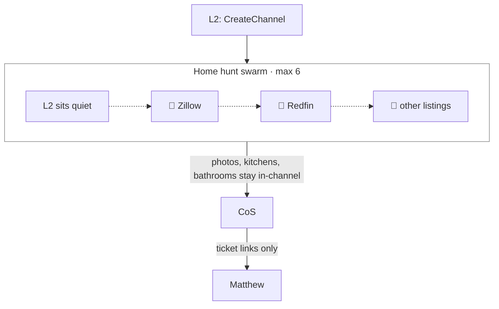
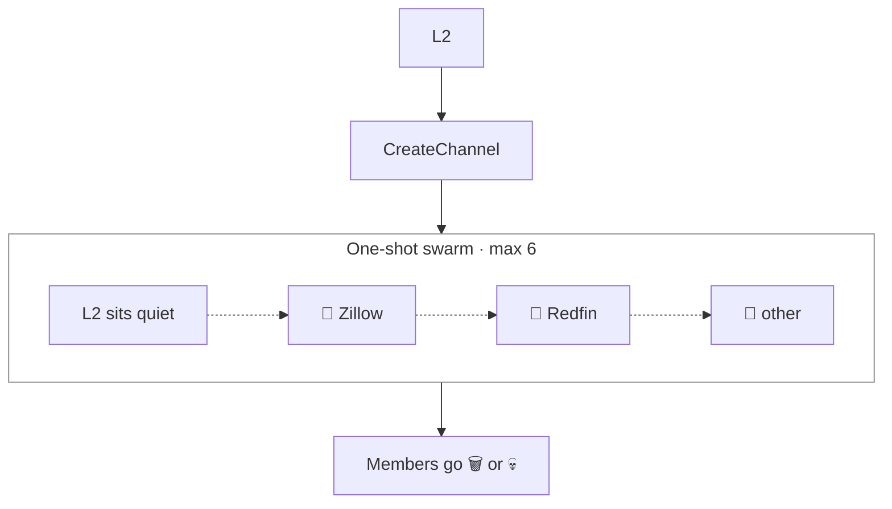
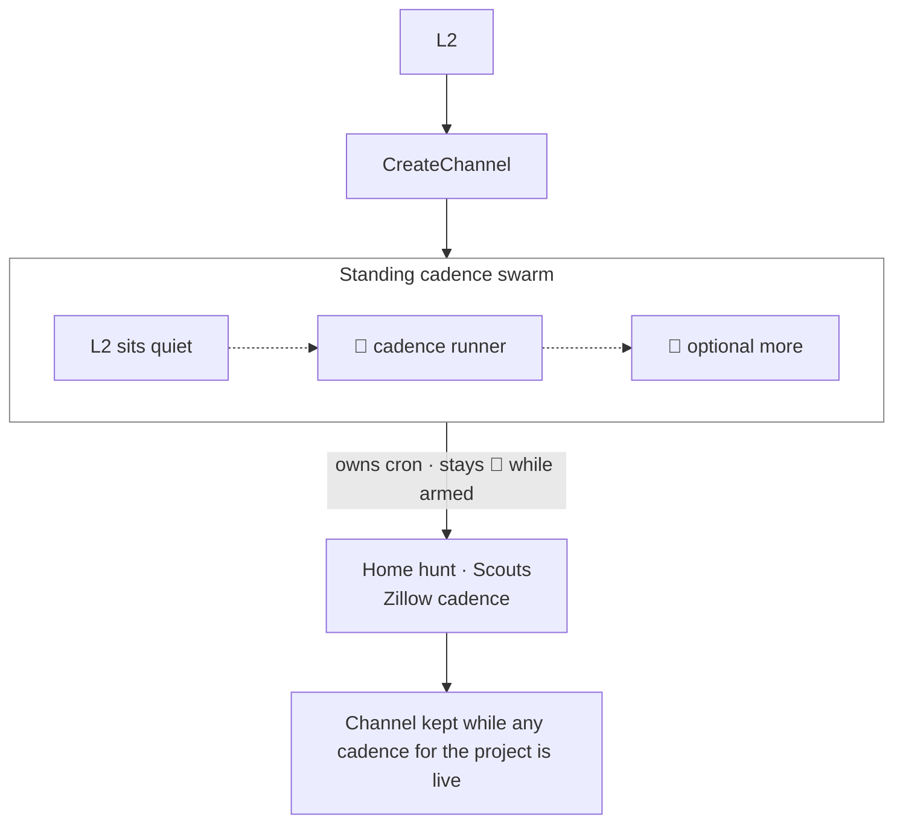

# Swarm channels

L2 opens the channel. L2 and the L3s sit in it. Work and handbacks stay there. CoS is not in the room — it only surfaces ticket links to Matthew. When the project is finished and no cadence runners remain, CoS names the channel; bots cannot delete it.

Keep the channel while the project is open or any cadence for it is still armed.

Multi-L3 jobs always swarm (max 6). They claim work and dedupe. Matthew never sees that channel unless he goes looking.

Two shapes of the same thing.

## One-shot swarm

A one-shot swarm is L2 plus disposable L3 temps for a single job — three listing-site scouts, for example. Members go 🗑 or 💀 when they finish. The channel may linger only if a related cadence is still live.

## Standing cadence swarm

A standing cadence swarm is L2 plus armed cadence runner(s). The runners stay 🔄 and own the cron. The channel stays up while any cadence for that project is live — Home hunt · Scouts with a Zillow cadence, for example.

See also: [cadence](cadence.md) · [emoji lifecycle](emoji-lifecycle.md) · [How I Run Grok Bot with BotOps](https://granda.org/en/2026/09/06/how-i-run-grok-bot/)
